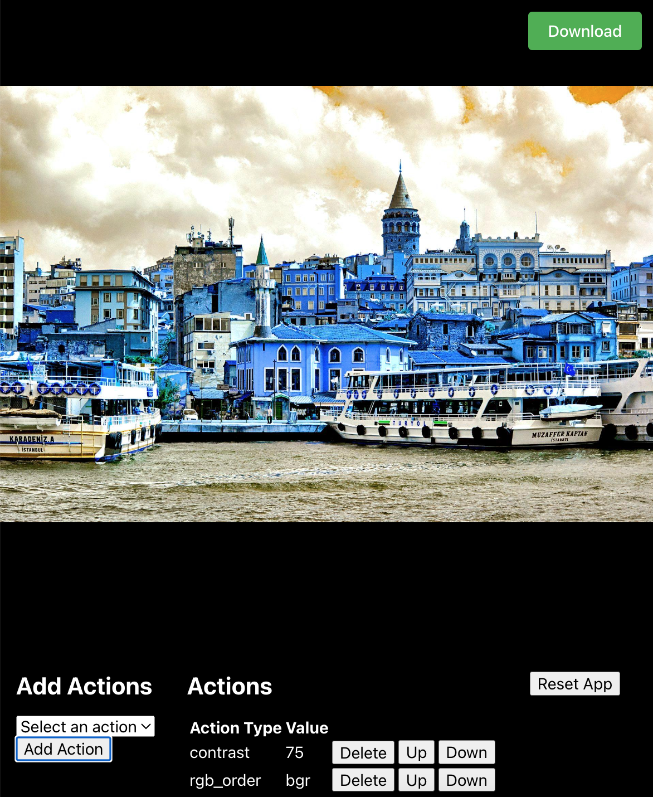

# Image Processing Tool

This application performs various image processing operations on images. It utilizes Flask to create an API for sending images, and React.js for displaying the edited images on the frontend. Users can apply the following operations to the images:

- **Blur**: Applies a blur effect to the image.
- **Brightness**: Adjusts the brightness of the image.
- **Contrast**: Adjusts the contrast of the image.
- **Flip**: Flips the image horizontally or vertically.
- **Gaussian Blur**: Applies a Gaussian blur effect to the image.
- **Grayscale**: Converts the image to grayscale.
- **RGB Order**: Rearranges the RGB order of the image.
- **Rotate**: Rotates the image by a specified angle.

After applying the desired operations, users have the option to download the edited image.

## How It Works

1. The user requests image processing by sending a GET request to the API endpoint. For example:

   ```
   GET http://localhost:5000/process?filename=sample.jpg&rotate=23&flip=1&brightness=50
   ```

   In this example, the user is specifying the filename of the image to be processed (`sample.jpg`) along with the desired operations such as rotation (`rotate=23`), flipping (`flip=1`), and brightness adjustment (`brightness=50`).

2. The Flask backend receives the request and extracts the parameters (filename, rotate, flip, brightness, etc.).

3. The backend loads the specified image (`sample.jpg` in this case) and applies the requested image processing operations (rotation, flipping, brightness adjustment, etc.) using the provided parameters.

4. Once the image processing is complete, the backend sends the processed image back to the frontend as a response.

5. The frontend receives the processed image from the backend and displays it to the user.

6. The user can then interact with the edited image and choose to download it if desired.

This API-based approach provides flexibility for users to specify their desired image processing operations through URL parameters and receive the processed image in real-time.

## Installation

1. Navigate to the root directory of the project:

   ```
   cd image-processing-tool/
   ```

2. Go to the `frontend` directory:

   ```
   cd frontend/
   ```

3. Install the necessary npm packages:

   ```
   npm install
   ```

4. Compile the application and build it into the `../backend/static/app` directory:

   ```
   npm run build
   ```

5. Navigate back to the parent directory and go to the `backend` directory:

   ```
   cd ..
   cd backend/
   ```

6. Install Python packages:

   ```
   pip install -r requirements.txt
   ```

## Usage

1. Start the server by running the following command in the `backend` directory:

   ```
   python server.py
   ```

2. Open your browser and navigate to `localhost:5000` to view the application.

## Screenshot



The image used as an example in this application is sourced from Unsplash and titled "Galata View from the Golden Horn". You can find the original source of this image [here](https://unsplash.com/photos/white-and-black-boat-on-water-near-buildings-during-daytime-qbaOwbtmfrI).
